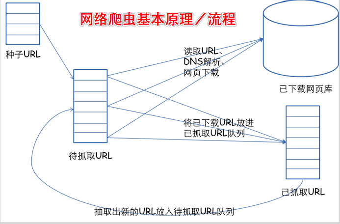

# ReptileTool

## Example
### 目的
1. 实践大话设计模式/swift基础语法/函数响应式开发

先来看看网络爬虫的基本原理：  
一个通用的网络爬虫的框架如图所示：  


网络爬虫的基本工作流程如下：
1. 首先选取一部分精心挑选的种子URL；
2. 将这些URL放入待抓取URL队列；
3. 从待抓取URL队列中取出待抓取在URL，解析DNS，并且得到主机的ip，并将URL对应的网页下载下来，存储进已下载网页库中。此外，将这些URL放进已抓取URL队列。
4. 分析已抓取URL队列中的URL，分析其中的其他URL，并且将URL放入待抓取URL队列，从而进入下一个循环。
网络数据抓取

概念：网络数据抓取，也叫网络爬虫。是在我们iOS程序中，获取要抓取到的网页上的数据。  
用处：如果要用到某网站的一些数据，这个时候我们就要用到抓取数据技术。   
建议：建议抓取过程中，多利用分类，多写一些分类方法，有助于提高程序可读性，也可提高效率。  


今天先来介绍一下第一种：正则表达式


To run the example project, clone the repo, and run `pod install` from the Example directory first.

## Requirements

## Installation

ReptileTool is available through [CocoaPods](https://cocoapods.org). To install
it, simply add the following line to your Podfile:

```ruby
pod 'ReptileTool'
```

## Author

huo3203@hotmail.com, 724987481@qq.com

## License

ReptileTool is available under the MIT license. See the LICENSE file for more info.
